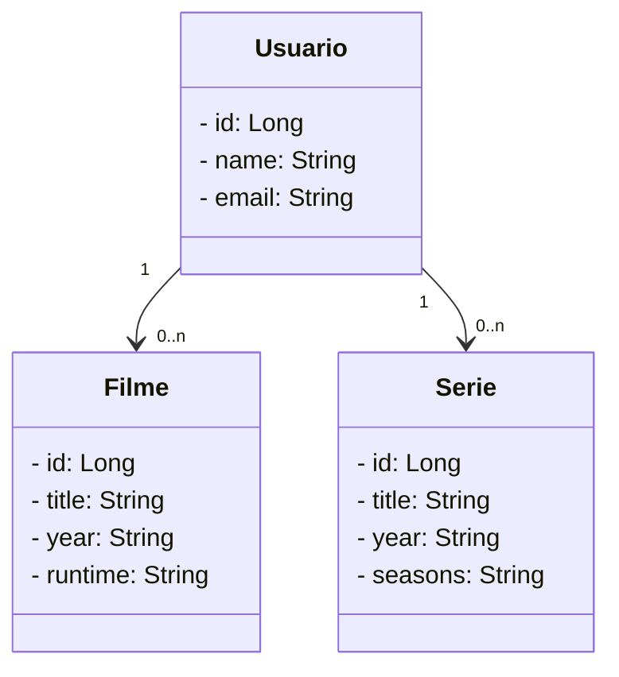

# Projeto Movies e Series

### **Projeto para o Bootcamp Java DIO**

Neste projeto, foi criado uma RESTful API para cadastro e recuperação de filmes e series, que podem ser adicionado a um usuário como uma lista de favoritos.

### **Swagger**

Swagger foi adiciona atraves do starter da OpenAPI para que fosse criado uma interface mais simples de acesso as reqeuisições da API.

#### **Diagrama de classes (Domínio da API)**

#### **Principais tecnologias**

 - **Java 17**
 - **Spring Boot 3**
 - **Spring Data JPA**
 - **OpenAPI (Swagger)**

